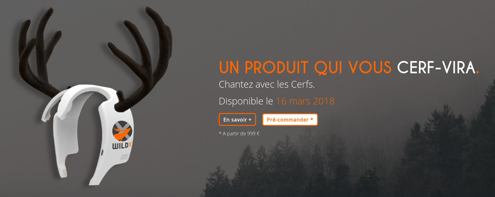

# Wild Cerf-Tête

## Instructions

First project of simulation of the Orleans Wild Code School.
Our trainers play the role of customers.
They order us a site to promote their revolutionary new product: a connected headband to communicate with deer!

## Description

Creation of a showcase website for the launch of a revolutionary connected headband for dialogue with the deer.
This product is marketed by the fictional company WildX.

## Mockups

## See the result

https://jualexandre.github.io/wild-cerf-tete

## Authors

* Louise ROY - [Louisejesuis](https://github.com/Louisejesuis/)
* Julien ALEXANDRE - [JuAlexandre](https://github.com/JuAlexandre/)
